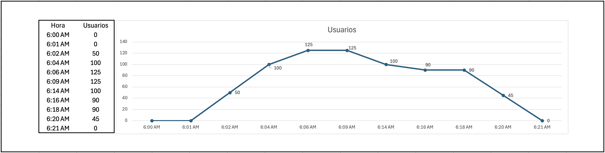
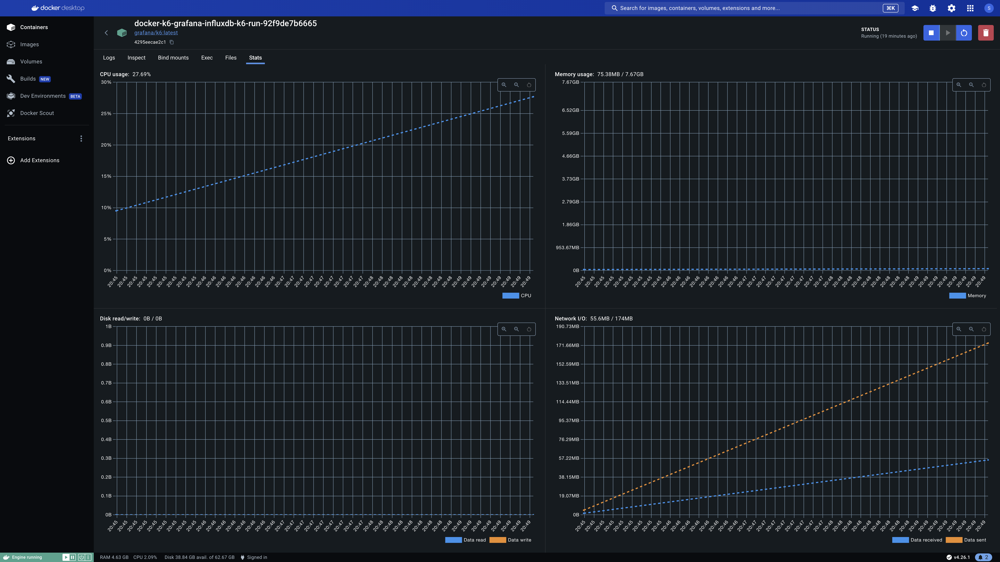
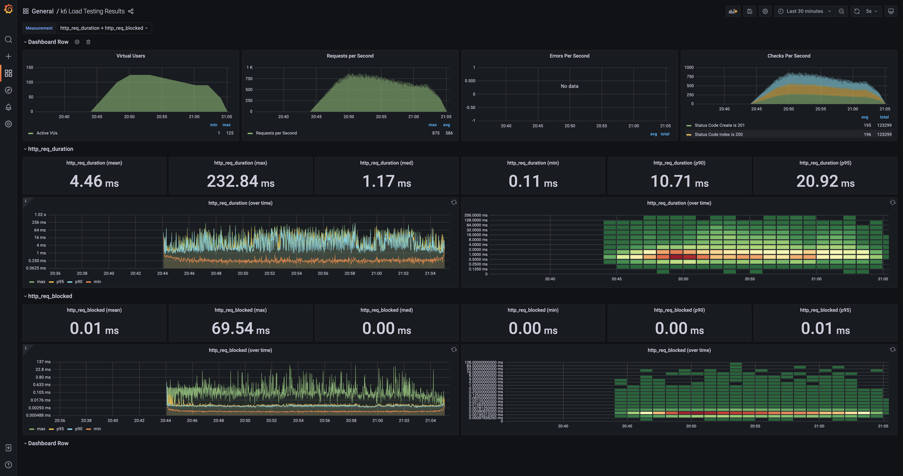

# Casos de Pruebas.

By Steve Araya

## Custom Test - Empresa 'K6 Company'.

Para la empresa 'K6 Company' se genera un caso de prueba Custom el cual se detalla a continuación:

- Los usuarios inician operaciones a las 6:00 am, inicialmente se conectan 50 usuarios en los primeros 2 minutos. (6:02 am)
- A las 6:02 am otros 50 usuarios se conectan a la aplicación incrementando la carga de usuarios en uso por 2 minutos. (6:04 am)
- Finalmente a las 6:04 am hasta las 6:06 am se terminan de conectar los usuarios restantes, los cuales representan 25 usuarios más. (6:06 am)
- La cantidad de usuarios máxima se mantiene por 3 minutos. (6:09 am)
- A las 6:09 am la cantidad de usuarios comienza a disminuir, se disminuye en 25 usuarios. Se mantiene por 5 minutos. (6:14 am)
- A las 6:14 am la cantidad de usuarios se disminuye en 10. Se mantiene por 2 minutos. (6:16 am)
- A las 6:16 am se mantienen los usuarios. Se mantiene por 2 minutos. (6:18 am)
- A las 6:18 am se disminuye la cantidad al 50%. Se mantiene por 2 minutos. (6:20 am)
- A las 6:21 am se disminuye la cantidad de usuarios a 0. (6:21 am)

A continuación se muestra el grafico del comportamiento de la prueba:

## Graficos de Docker.
En el siguiente grafico se muestra el consumo de recursos por parte de la aplicación que se encuentra en Docker.

## Graficos de Grafana.
En el siguiente grafico se muestra las estadisticas brindadas por Grafana.

